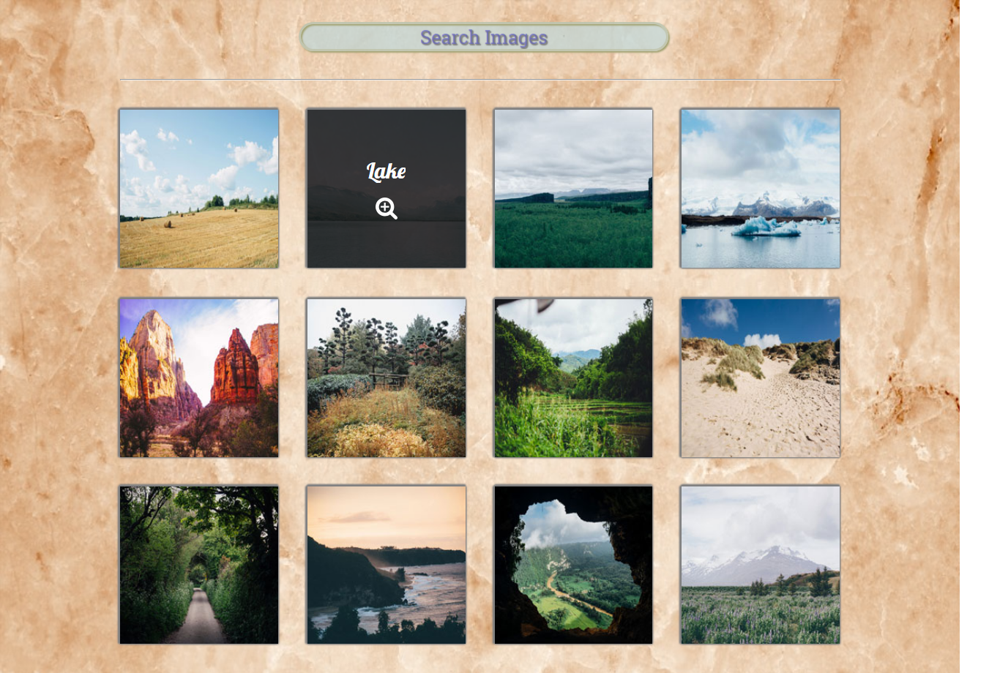

# treehouse-frontend-project05
TreeHouse FrontEnd Project 5 - Photo Gallery

[Click here](https://canpu.github.io/treehouse-frontend-project05/) to view the demo

## Brief Introduction

* The webpage is an iteractive photo gallery with mobile first responsive design.
* There are 12 photos embeded on the wall
* Hovering overing a photo, its name would appear.
* Clicking any photo would lead you to a lightbox, in which a magnified version is shown for the corresponding photo.
* One can navigate through all photos in the lightbox via the previous and next button (or via the keyboard).

